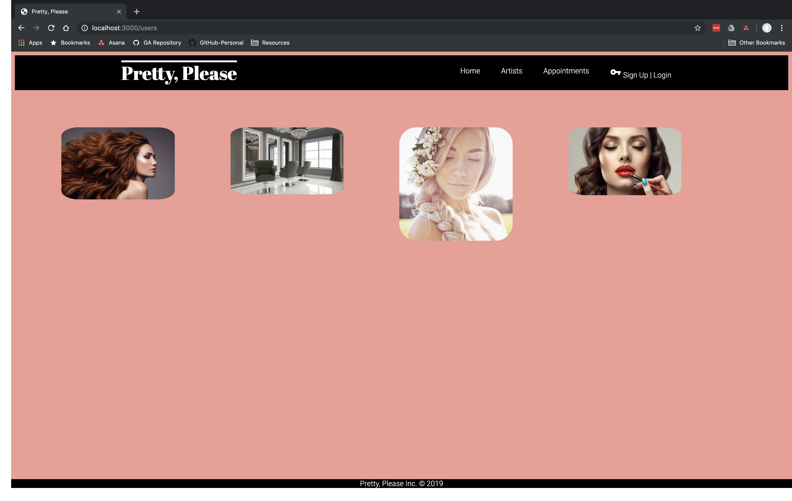
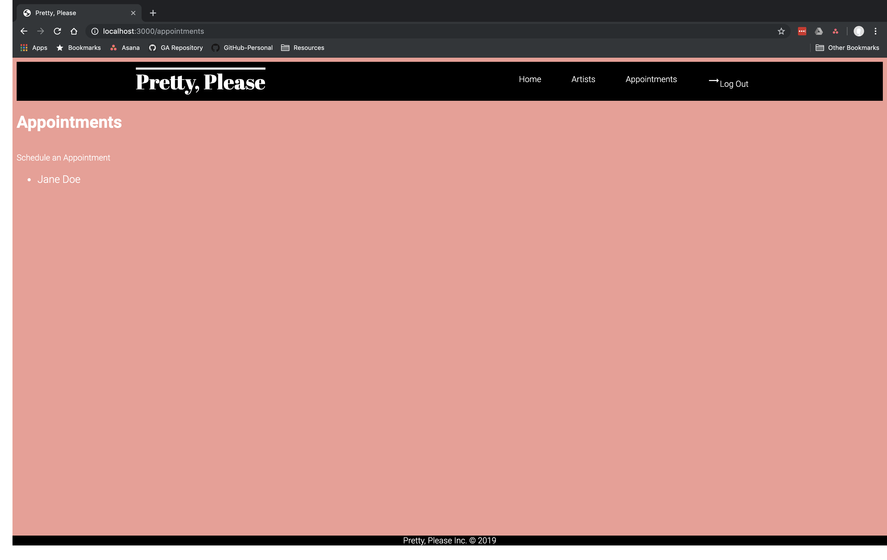
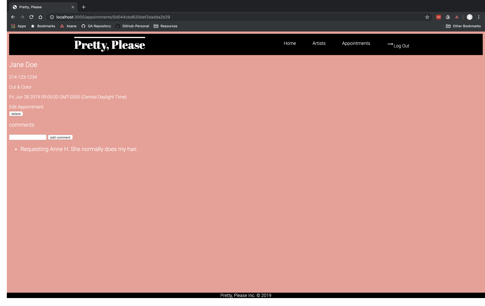
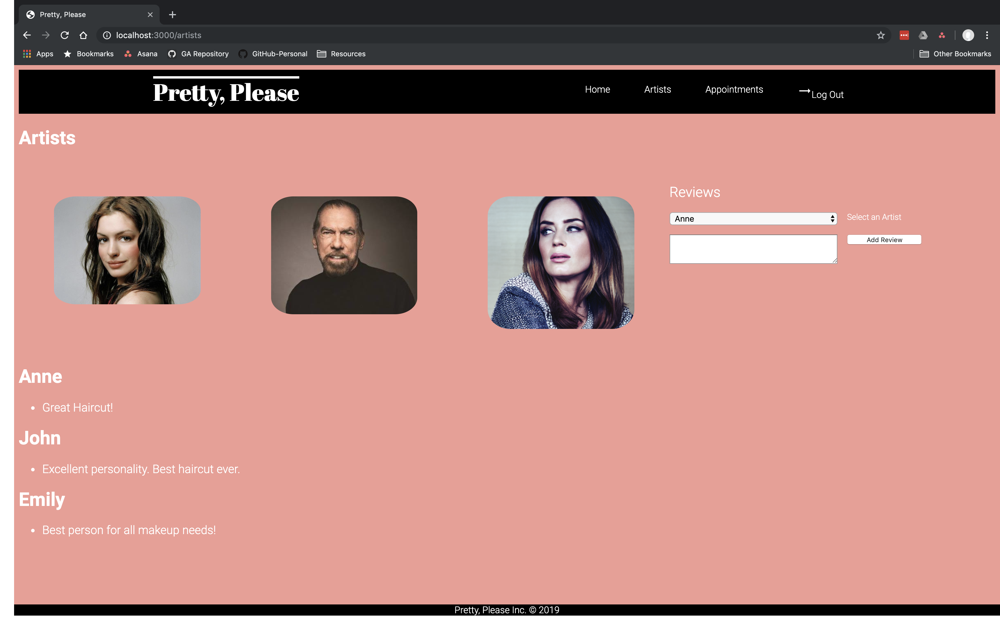

<h1>Pretty, Please - Makeup & Hair Appointment App</h1>

With "Pretty, Please" you can schedule services on the go.  Have a last minute change of plans?  You can always update, comment or delete an appointment after it is scheduled.  We will always have a top professional available at your convenience.  After a great experience, it is always encouraged to leave a review of the artist who performed the services.

Clients must be logged in to edit or delete an appointment.
 

<h1>Technologies Used:</h1>

JavaScript, HTML5, CSS3, Materialize, Express, Node, Google OAuth and MongoDB.
 

<h1>Getting Started:</h1>
https://pretty-please-sei.herokuapp.com/users

<h1>ERD</h1>

<h1>Wireframes</h1>

<h1>Screenshots of App</h1>

<h1>Next Steps:</h1>
Update the overall design and brand.
Client will be able to edit and delete artist reviews.
Limit what a non-member can view.

